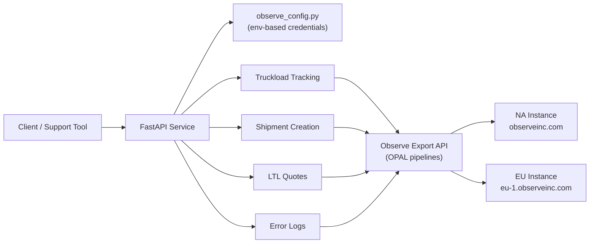

# Observe Logistics API

A production-ready **FastAPI** service that turns [Observe](https://www.observeinc.com/) observability data into actionable logistics insights. The API exposes structured endpoints for truckload tracking, shipment creation forensics, LTL rate quotes, and error log investigation — without requiring analysts to write OPAL queries or navigate the Observe UI manually.

Built for **multi-region deployments** (North America and EU), **async high-throughput querying**, and **containerized cloud delivery** on Azure.

---

## Why this project exists

Logistics platforms generate massive volumes of distributed trace data across shipment APIs, carrier integrations, and vendor tracking systems. When something goes wrong — a missing status update, a failed shipment creation, or an unexplained rate quote — engineers often spend valuable time manually searching Observe logs, correlating trace IDs, and stitching together vendor vs. carrier events.

This service automates that workflow:

| Problem | How this API helps |
|---|---|
| Manual log searching in Observe | Pre-built OPAL pipelines for common logistics scenarios |
| Scattered trace data across vendors | Correlates shipment, tracking method, and status events automatically |
| Slow queries over large time windows | Parallel async queries with time-window chunking |
| NA vs. EU data residency | Instance-aware credential routing (`NA` / `EU`) |
| Operational toil for support teams | Single REST call returns structured JSON ready for dashboards or tools |

---

## Key features

- **Truckload tracking** — Retrieves shipment records, resolves tracking methods, and fetches vendor/carrier status updates based on vendor type (`API_PUSH`, `MOBILE_PHONE`)
- **Shipment creation forensics** — Reconstructs the full creation lifecycle from Observe server request/response logs
- **LTL rate quote lookup** — Finds quote events and generates a direct Observe Log Explorer deep-link for investigation
- **Error log search** — Pulls correlated error entries by error ID across configurable time ranges
- **Async-first architecture** — Parallel chunk execution via `asyncio` and `aiohttp` for faster results on large datasets
- **Resilient Observe integration** — Cursor-based pagination, exponential backoff polling, cursor expiry retry, and HTTP error recovery
- **Secure configuration** — All credentials loaded from environment variables via `.env` (never committed)
- **Cloud-ready** — Dockerized with Gunicorn + Uvicorn workers; CI/CD pipelines for Azure Container Apps

---

## Architecture



**Request flow (truckload tracking example):**

1. Client sends a shipment identifier or master shipment ID
2. Service queries Observe for matching shipment server responses (parallel 24-hour chunks)
3. Unique trace IDs are extracted and used to resolve the tracking vendor type
4. Vendor-specific status pipelines run in parallel (vendor + carrier paths for `API_PUSH`)
5. Results are deduplicated and returned as structured JSON

---

## Tech stack

| Layer | Technology |
|---|---|
| API framework | FastAPI |
| Async HTTP | aiohttp, asyncio |
| Server | Gunicorn + UvicornWorker |
| Config | python-dotenv |
| Container | Docker (Python 3.11) |
| CI/CD | Azure DevOps Pipelines |
| Deployment target | Azure Container Apps |

---

## Project structure

```
.
├── main.py                          # FastAPI app and route definitions
├── utilities/
│   ├── errors/
│   │   └── custom_exceptions.py     # Typed application exceptions
│   └── helpers/
│       ├── observe_config.py        # Environment-based NA/EU credential loader
│       ├── observe_truckload_tracking.py
│       ├── observe_shipment_creation.py
│       ├── observe_ratequote.py
│       ├── observe_error_logs.py
│       └── response_formatter.py    # Consistent API response envelope
├── Dockerfile
├── gunicorn.conf.py
├── requirements.txt
├── .env.example                     # Template for local configuration
└── azure-pipelines.yml              # Dev deployment pipeline
```

---

## Getting started

### Prerequisites

- Python 3.11+
- An Observe account with API access (NA and/or EU)
- Observe dataset ID, instance ID, customer ID, and access key for each region you use

### Installation

```bash
git clone https://github.com/<your-username>/<your-repo>.git
cd <your-repo>

python -m venv .venv
source .venv/bin/activate        # Windows: .venv\Scripts\activate

pip install -r requirements.txt
```

### Configuration

Copy the example environment file and fill in your Observe credentials:

```bash
cp .env.example .env
```

| Variable | Description |
|---|---|
| `NA_OBSERVE_CUSTOMER_ID` | Observe customer ID (North America) |
| `NA_OBSERVE_ACCESS_KEY` | Observe API access key (North America) |
| `NA_OBSERVE_DATASET_ID` | Dataset ID for log queries (NA) |
| `NA_OBSERVE_INSTANCE_ID` | Observe workspace instance ID (NA) |
| `NA_OBSERVE_DOMAIN` | Optional — defaults to `observeinc.com` |
| `EU_OBSERVE_*` | Same set of variables for the EU instance |
| `CUSTOM_RESPONSE_TYPE` | Response MIME type — defaults to `application/json` |

> **Never commit `.env`.** It is listed in `.gitignore`. Only `.env.example` belongs in version control.

### Run locally

```bash
# Development server
python main.py

# Or with uvicorn directly
uvicorn main:app --host 0.0.0.0 --port 3100 --reload
```

Health check: `GET http://localhost:3100/` → `{"Health": "ok"}`

### Run with Docker

```bash
docker build -t observe-logistics-api .
docker run --env-file .env -p 3100:3100 observe-logistics-api
```

---

## API reference

All endpoints accept and return JSON. Responses follow a consistent envelope:

```json
{
  "timestamp": "2026-07-26T00:00:00.000Z",
  "status": 200,
  "message": "successfully fetched observe data",
  "data": { }
}
```

### `GET /`

Health check endpoint.

### `POST /observe/truckload/tracking`

Fetch truckload shipment data, tracking method, and status updates.

**Request body (option A — master shipment ID):**

```json
{
  "master_shipment_id": "6fc36462-15f1-45b4-921b-2816bc31b872",
  "instance": "NA"
}
```

**Request body (option B — BOL + carrier):**

```json
{
  "shipment_identifier": "404002547466",
  "carrier_identifier": "143155",
  "instance": "NA"
}
```

| Field | Required | Description |
|---|---|---|
| `master_shipment_id` | One of A or B | UUID of the master shipment |
| `shipment_identifier` | One of A or B | BOL or shipment reference number |
| `carrier_identifier` | With option B | Carrier SCAC or identifier |
| `instance` | No | `NA` (default) or `EU` |

---

### `POST /observe/shipment/creation`

Reconstruct shipment creation events from Observe logs.

```json
{
  "master_shipment_id": "6fc36462-15f1-45b4-921b-2816bc31b872",
  "instance": "NA"
}
```

Or search by shipment identifier:

```json
{
  "shipment_identifier": "404002547466",
  "instance": "EU"
}
```

---

### `POST /observe/ltl/quotes`

Look up LTL rate quote events and return an Observe Log Explorer deep-link.

```json
{
  "rate_quote_id": "your-rate-quote-id"
}
```

**Response data includes:**

```json
{
  "rate_quote_id": "your-rate-quote-id",
  "observe-ratequote-filter-url": "https://<customer>.observeinc.com/workspace/..."
}
```

---

### `POST /observe/error/logs`

Search Observe logs for entries related to a specific error ID.

```json
{
  "error_id": "your-error-id",
  "instance": "NA"
}
```

---

## Design decisions worth noting

These choices reflect production constraints, not just feature delivery:

- **Time-window chunking** — Large 30-day lookups are split into 24-hour chunks and executed in parallel to stay within Observe query limits and reduce timeout risk.
- **Cursor polling with adaptive backoff** — Observe export queries return `202 Accepted` while processing; the client polls with increasing wait intervals and handles `410 Gone` (expired cursor) by reissuing the query.
- **Vendor-aware tracking pipelines** — Different OPAL filters are applied for `API_PUSH` (vendor + carrier parallel paths) vs. `MOBILE_PHONE` (vendor-only path).
- **Early-exit phase search** — Shipment creation queries scan time phases sequentially and stop as soon as results are found, avoiding unnecessary API calls.
- **Centralized credential module** — A single `get_credentials(instance)` function keeps NA/EU routing consistent across all helpers and makes rotation straightforward.
- **Structured error responses** — Custom exceptions map to predictable HTTP status codes and JSON error envelopes for downstream consumers.

---

## Deployment

The included Azure DevOps pipelines build a Docker image, push to Azure Container Registry, and deploy to **Azure Container Apps**:

- `azure-pipelines.yml` — development (`develop` branch)
- `azure-pipelines-main.yml` — production (`main` branch)

Pipeline secrets (e.g. `acrPassword`) and Observe credentials should be configured as **secret variables** or **Key Vault references** in Azure — not stored in source code.

Gunicorn is configured with Uvicorn workers, a 600-second timeout for long-running Observe queries, and worker recycling after 1000 requests.

---

## What this demonstrates

For reviewers evaluating this repository:

- Building **async Python services** that integrate with third-party observability APIs at scale
- Designing **REST APIs** with consistent contracts, input validation, and error handling
- Applying **OPAL query pipelines** to solve real operational problems in logistics
- Handling **multi-region configuration**, pagination, retries, and partial failure in distributed data systems
- Delivering **production-grade deployments** with Docker, Gunicorn, and Azure CI/CD

---

## License

This project is open source. Add your preferred license file (e.g. MIT) before publishing if you have not already.

## Contributing

Issues and pull requests are welcome. Please do not include credentials, customer IDs, or internal infrastructure details in commits or discussions.
